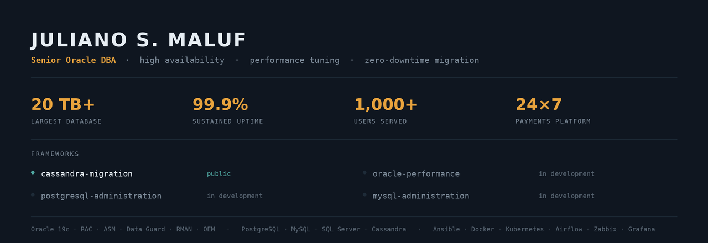

**[English](#english) · [Português](#português)**

---

## English

### Senior Oracle DBA — high availability, performance tuning and database migrations

I administer the entire corporate database platform at a payments company — Oracle, PostgreSQL, SQL Server and MySQL — supporting databases above **20 TB** and more than **1,000 users** at **99.9% uptime**.

Eight years in mission-critical environments. I started in Windows infrastructure and server administration, moved through SQL Server, MySQL and PostgreSQL, and specialized in Oracle Database.

**Where my time actually goes**

- **Performance** — diagnosis with AWR, ASH and Explain Plan; SQL and PL/SQL optimization; session, lock and contention analysis
- **Availability** — Oracle RAC, Data Guard and Data Guard Broker; controlled failover and switchover; RMAN backup and recovery with restores that have actually been tested
- **Migration** — cross-datacenter Oracle RAC migration with controlled switchover and zero incidents; upgrades 11.2.0.3 → 11.2.0.4 → 19c/19.25; PDB consolidation; PostgreSQL 12 → 16 with minimal downtime
- **Automation** — bringing Ansible, containers and CI/CD practices into database operations

**Stack**

| Area | Tools |
|---|---|
| Databases | Oracle 11g/12c/19c (RAC, ASM, Data Guard, RMAN, OEM, Multitenant), PostgreSQL, MySQL, SQL Server, Cassandra |
| Operating systems | Oracle Linux, Ubuntu, Debian, CentOS, Windows Server |
| Automation | Ansible / AWX, Shell, Python, PowerShell, Git, Apache Airflow |
| Containers | Docker, Kubernetes |
| Observability | Zabbix, Grafana, AWR / ASH |
| Cloud | Oracle Cloud Infrastructure |
| Application servers | WebLogic, JBoss, Apache HTTP Server, NGINX |

**About the repositories here**

Most of my automation runs against production systems I don't own, so those repositories stay private. What I publish are generalized rewrites — same technique, no client configuration, example data only. Currently in preparation:

- **Zero-impact maintenance framework (Oracle)** — statistics collection and online index rebuilds inside Scheduler windows, with Resource Manager capping CPU and AWR validating the gain before and after. Built around one rule: maintenance must not compete with the application.
- **AWR-based performance analysis** — turning AWR data and execution plans into a prioritized findings report
- **PostgreSQL deployment and standardization** — reproducible provisioning with a configuration baseline
- **Cassandra cluster automation** — containerized deployment with backup and compression

**Certifications**

Oracle Cloud Infrastructure Foundations Associate · Oracle Cloud Infrastructure AI Foundations Associate · currently preparing for OCP Database Administrator

**Contact**

[LinkedIn](https://www.linkedin.com/in/juliano-s-maluf-0615449b) · julianomaluf@hotmail.com

Technical reading, writing and documentation in English at professional level. Portuguese native.

---

## Português

### DBA Oracle Sênior — alta disponibilidade, performance tuning e migração de bancos de dados

Respondo por toda a plataforma corporativa de bancos de dados de uma empresa de meios de pagamento — Oracle, PostgreSQL, SQL Server e MySQL — sustentando bases acima de **20 TB** e mais de **1.000 usuários** com **99,9% de disponibilidade**.

Oito anos em ambientes de missão crítica. Comecei em infraestrutura e administração de servidores Windows, passei por SQL Server, MySQL e PostgreSQL, e me especializei em Oracle Database.

**No que meu tempo realmente vai**

- **Performance** — diagnóstico com AWR, ASH e Explain Plan; otimização de SQL e PL/SQL; análise de sessões, locks e contenção
- **Disponibilidade** — Oracle RAC, Data Guard e Data Guard Broker; failover e switchover controlados; backup e recovery com RMAN e restore efetivamente testado
- **Migração** — migração de Oracle RAC entre datacenters com switchover controlado e zero incidentes; upgrades 11.2.0.3 → 11.2.0.4 → 19c/19.25; consolidação de PDBs; PostgreSQL 12 → 16 com downtime mínimo
- **Automação** — levar Ansible, containers e práticas de CI/CD para a operação de banco de dados

**Stack**

| Área | Ferramentas |
|---|---|
| Bancos de dados | Oracle 11g/12c/19c (RAC, ASM, Data Guard, RMAN, OEM, Multitenant), PostgreSQL, MySQL, SQL Server, Cassandra |
| Sistemas operacionais | Oracle Linux, Ubuntu, Debian, CentOS, Windows Server |
| Automação | Ansible / AWX, Shell, Python, PowerShell, Git, Apache Airflow |
| Containers | Docker, Kubernetes |
| Observabilidade | Zabbix, Grafana, AWR / ASH |
| Cloud | Oracle Cloud Infrastructure |
| Servidores de aplicação | WebLogic, JBoss, Apache HTTP Server, NGINX |

**Sobre os repositórios daqui**

Boa parte da minha automação roda em ambientes de produção que não são meus, e esses repositórios permanecem privados. O que publico são versões genéricas reescritas — mesma técnica, sem configuração de cliente, apenas dados de exemplo. Em preparação:

- **Framework de manutenção com impacto zero (Oracle)** — coleta de estatísticas e rebuild online de índices em janelas do Scheduler, com Resource Manager limitando CPU e AWR validando o ganho antes e depois. Construído sobre uma regra: manutenção não deve competir com a aplicação.
- **Análise de performance baseada em AWR** — transformar dados de AWR e planos de execução em relatório priorizado de achados
- **Implantação e padronização de PostgreSQL** — provisionamento reproduzível com baseline de configuração
- **Automação de cluster Cassandra** — deploy em container com backup e compressão

**Certificações**

Oracle Cloud Infrastructure Foundations Associate · Oracle Cloud Infrastructure AI Foundations Associate · em preparação para OCP Database Administrator

**Contato**

[LinkedIn](https://www.linkedin.com/in/juliano-s-maluf-0615449b) · julianomaluf@hotmail.com
